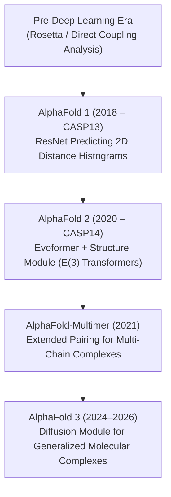

# Awesome-AlphaFold 🧬

  

   

## 🧬 The AlphaFold Structural Biology Map

> **A comprehensive reference guide for DeepMind’s AlphaFold—mapping its core architecture, performance milestones, and deep evolutionary lineage from early structural biology models.**

AlphaFold transformed structural biology by solving the 50-year-old "protein folding challenge," predicting 3D atomic protein structures directly from 1D amino acid sequences with experimental-level accuracy.

---

## 📅 The Evolutionary Timeline

The journey from statistical physics to deep end-to-end geometric architectures.

---

## 🧬 Architectural Evolution & Technical Precursors

| Era / Version | First Used (Year) | Key Mechanisms & Core Architecture | Primary Publication (Paper) |
| :--- | :--- | :--- | :--- |
| [**1. The Pre-Deep Learning Foundation**](docs/pre_deep_learning.md) | **Rosetta:** 1997 **DCA:** 2011 | **Rosetta:** Monte Carlo sampling to assemble fragment structural motifs based on physical energy functions. **Direct Coupling Analysis (DCA):** Statistical physics to detect co-evolutionary mutations in MSAs for contact prediction. | - [Rosetta (Simons et al., 1997)](https://doi.org/10.1006/jmbi.1997.0959) - [DCA (Morcos et al., 2011)](https://doi.org/10.1073/pnas.1111471108) |
| [**2. AlphaFold 1**](docs/alphafold_1.md) | 2018 *(CASP13)* | **ResNet predicting 2D distance histograms.** Treated MSA matrix like an image to predict a distogram (distance probability distribution) and backbone torsion. Downstream L-BFGS gradient descent constructed 3D coordinates. Not end-to-end. | [Senior et al., 2020](https://doi.org/10.1038/s41586-019-1923-7) |
| [**3. AlphaFold 2**](docs/alphafold_2.md) | 2020 *(CASP14)* | **Evoformer + Invariant Structure Module (IPA).** Evoformer exchanges info between MSA and pair representations. Structure Module operates in 3D using rigid-body "gas cloud" representations and SE(3)-equivariant attention. End-to-end. | [Jumper et al., 2021](https://doi.org/10.1038/s41586-021-03819-2) |
| [**4. AlphaFold-Multimer**](docs/alphafold_multimer.md) | 2021 | **Evolution of AF2 for multi-chain tracking.** Adjusted MSA processing layers to distinguish intra-chain contacts from inter-chain contacts to predict massive complexes. | [Evans et al., 2021](https://doi.org/10.1101/2021.10.04.463034) |
| [**5. AlphaFold 3**](docs/alphafold_3.md) | 2024 | **Pairformer + Diffusion Module.** Replaced Evoformer with a lighter Pairformer matrix and uses a Generative Diffusion Model to denoise atomic coordinates. Predicts proteins, DNA, RNA, ligands, and ions. | [Abramson et al., 2024](https://doi.org/10.1038/s41586-024-07487-w) |

---

## 🎛️ Feature Comparison Matrix

| Attribute | AlphaFold 1 | AlphaFold 2 | AlphaFold 3 |
| :--- | :--- | :--- | :--- |
| **Primary Engine** | Convolutional ResNet | Evoformer + Equivariant IPA | Pairformer + Diffusion Module |
| **Output Type** | 2D Distance Matrices | 3D Rigid-body Coordinates | 3D Raw Atomic Coordinates |
| **Target Scope** | Single Protein Chains | Proteins & Simple Multimers | Proteins, DNA, RNA, Ligands, Glycans |
| **Hardware Overhead** | Moderate | High (Extensive MSA compute) | Optimized (Lighter attention layers) |

---

## 🚀 Real-World Applications

*   **Structure-Based Drug Design (SBDD):** Zeroing in on precisely where small-molecule drugs bind to viral or bacterial targets without waiting years for experimental crystal structures.
*   **Enzyme Engineering:** Modeling synthetic, plastic-degrading enzymes or custom biocatalysts for green chemistry applications.
*   **Variant Impact Predictors:** Cross-referencing AlphaFold models with disease mutations to map exactly how single-point genetic mutations destabilize crucial human receptors.

##  Star History

<a href="https://www.star-history.com/?repos=ishandutta2007%2FAwesome-AlphaFold&type=date&legend=bottom-right">
<picture>
<source media="(prefers-color-scheme: dark)" srcset="https://api.star-history.com/chart?repos=ishandutta2007/Awesome-AlphaFold&type=date&theme=dark&legend=bottom-right" />
<source media="(prefers-color-scheme: light)" srcset="https://api.star-history.com/chart?repos=ishandutta2007/Awesome-AlphaFold&type=date&legend=bottom-right" />

</picture>
</a>

