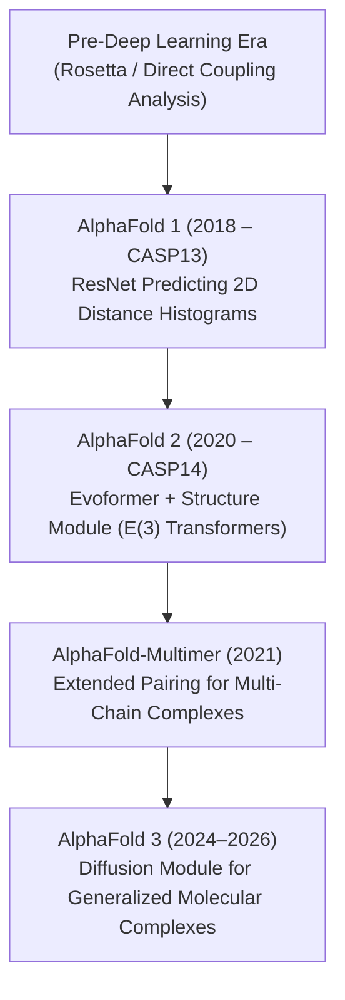

# Awesome-AlphaFold
## 🧬 The AlphaFold Structural Biology Map

> **A comprehensive reference guide for DeepMind’s AlphaFold—mapping its core architecture, performance milestones, and deep evolutionary lineage from early structural biology models.**

AlphaFold transformed structural biology by solving the 50-year-old "protein folding challenge," predicting 3D atomic protein structures directly from 1D amino acid sequences with experimental-level accuracy.

---

## 📅 The Evolutionary Timeline

The journey from statistical physics to deep end-to-end geometric architectures.

---

## 🧬 Architectural Evolution & Technical Precursors

-	### 1. The Pre-Deep Learning Foundation
	Before machine learning dominated, structural prediction relied on thermodynamic physics, template matching, and statistical co-evolution.
	*   **Rosetta (David Baker Lab):** Utilized Monte Carlo sampling to assemble fragment structural motifs based on physical energy functions.
	*   **Direct Coupling Analysis (DCA):** Used statistical physics to detect co-evolutionary mutations in Multiple Sequence Alignments (MSAs). If residue A and residue B mutated together across species, they were likely physically touching in 3D space.

-	### 2. AlphaFold 1 (CASP13 - 2018)
	DeepMind's first entry applied standard Deep Computer Vision architectures to biological data.
	*   **Core Architecture:** A deep Convolutional Neural Network (ResNet) trained on 2D representations.
	*   **Mechanism:** Took an MSA matrix and treated it like an image. The ResNet predicted a **distogram** (a probability distribution matrix of distances between all pairs of amino acids) and a backbone torsion angle distribution.
	*   **Downstream Step:** A classic gradient descent algorithm (L-BFGS) then constructed the physical 3D coordinates based on those predicted distances.
	*   **Limitation:** The model was not "end-to-end"; the neural network only predicted spatial targets, leaving the actual 3D building phase to external physics algorithms.

-	### 3. AlphaFold 2 (CASP14 - 2020)
	A complete structural redesign that threw out conventional convolutions in favor of attention mechanisms tailored specifically to physics and geometry.
	*   **Core Architecture:** **Evoformer** paired with an **Invariant Structure Module (IPA)**.
	*   **Mechanism:** 
	    *   *Evoformer:* A specialized Transformer architecture that simultaneously passes information back and forth between MSA representations and spatial 2D pair representations.
	    *   *Structure Module:* Operates directly in 3D space. It treats every amino acid residue as a rigid "gas cloud" body (with 3 translation and 3 rotation degrees of freedom) and dynamically moves them into position using SE(3)-equivariant attention without a secondary physics compiler.
	*   **Impact:** Reached a GDT (Global Distance Test) score above 90, matching the precision of manual X-ray crystallography.

-	### 4. AlphaFold-Multimer (2021)
	*   **Core Architecture:** An evolution of AlphaFold 2 adapted for multi-chain tracking.
	*   **Mechanism:** Adjusted the MSA processing layers to distinguish between intra-chain contacts (within a protein) and inter-chain contacts (where two distinct proteins touch), allowing the model to predict massive protein complexes.

-	### 5. AlphaFold 3 (2024 - 2026)
	A fundamental shift from predicting just proteins to modeling the entire biomolecular universe.
	*   **Core Architecture:** **Pairformer** paired with a **Diffusion Module**.
	*   **Mechanism:** Replaced the heavy computational Evoformer with a lighter Pairformer matrix. Instead of mapping rigid structural bodies step-by-step, it uses a **Generative Diffusion Model** (similar to image generation models). It starts with a chaotic cloud of atoms and denoises them into a precise 3D arrangement based on the input prompt.
	*   **Capabilities:** Predicts proteins, DNA, RNA, chemical ligands, ions, and chemical modifications (like phosphorylation) inside a unified pipeline.

---

## 🎛️ Feature Comparison Matrix

| Attribute | AlphaFold 1 | AlphaFold 2 | AlphaFold 3 |
| :--- | :--- | :--- | :--- |
| **Primary Engine** | Convolutional ResNet | Evoformer + Equivariant IPA | Pairformer + Diffusion Module |
| **Output Type** | 2D Distance Matrices | 3D Rigid-body Coordinates | 3D Raw Atomic Coordinates |
| **Target Scope** | Single Protein Chains | Proteins & Simple Multimers | Proteins, DNA, RNA, Ligands, Glycans |
| **Hardware Overhead** | Moderate | High (Extensive MSA compute) | Optimized (Lighter attention layers) |

---

## 🚀 Real-World Applications

*   **Structure-Based Drug Design (SBDD):** Zeroing in on precisely where small-molecule drugs bind to viral or bacterial targets without waiting years for experimental crystal structures.
*   **Enzyme Engineering:** Modeling synthetic, plastic-degrading enzymes or custom biocatalysts for green chemistry applications.
*   **Variant Impact Predictors:** Cross-referencing AlphaFold models with disease mutations to map exactly how single-point genetic mutations destabilize crucial human receptors.

