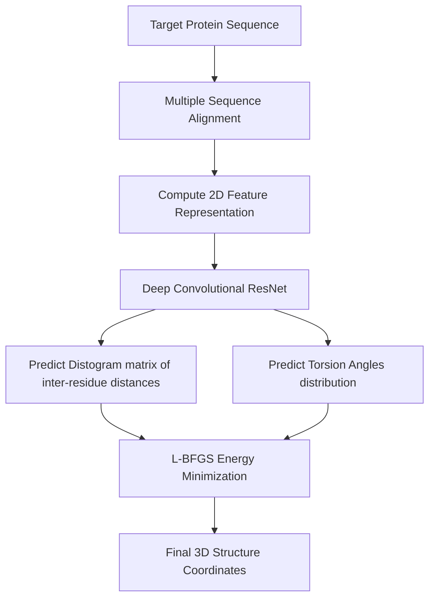

# 🧬 AlphaFold 1

AlphaFold 1 (introduced at CASP13 in 2018) was Google DeepMind's first neural network model for protein structure prediction, leveraging a deep residual convolutional network.

## 🗺️ Architectural Concept / Workflow

## 🔍 Detailed Overview

### 1. Representation & Distogram Prediction
AlphaFold 1 reformulates the 3D structure prediction problem as a 2D image processing problem. By processing features from the MSA, a ResNet with 220 residual blocks is trained to output:
- **Distogram:** A probability distribution of distances between $C_\beta$ atoms (and $C_\alpha$ for glycine) for every pair of residues.
- **Torsion Angles:** Phi and Psi backbone angle probability distributions.

### 2. Downstream Optimization (L-BFGS)
Because AlphaFold 1 is not end-to-end differentiable for 3D coordinates, it relies on a secondary, classical optimization step. It translates the predicted distance and angle distributions into a continuous potential energy function and uses the L-BFGS gradient descent algorithm to compute the final 3D atomic coordinates.

## 📄 Key Publications & References
- **AlphaFold 1 Paper:** Senior, A. W., Evans, R., Jumper, J., Kirkpatrick, J., Sifre, L., Green, T., Qin, C., Žídek, A., Nelson, A. W. R., Bridgland, A., Pullan, H., Green, N., Tubby, G., Back, L., Sirells, C., Lau, S., Hasegawa, Y., Morrison, J. R., Alassaf, R., ... Hassabis, D. (2020). Improved protein structure prediction using potentials from deep learning. *Nature*, 577(7792), 706-710. [DOI: 10.1038/s41586-019-1923-7](https://doi.org/10.1038/s41586-019-1923-7)

[⬅️ Back to README](../README.md)
