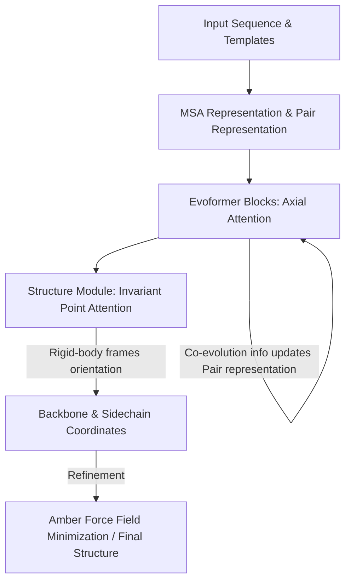

# 🧬 AlphaFold 2

AlphaFold 2 (introduced at CASP14 in 2020) achieved experimental-level accuracy using an end-to-end differentiable transformer-like architecture designed specifically for structural biology.

## 🗺️ Architectural Concept / Workflow

## 🔍 Detailed Overview

### 1. Evoformer
The Evoformer replaces traditional convolutions with attention mechanisms. It operates on two main data structures:
- **MSA Representation:** Encodes phylogenetic relationships and evolutionary information.
- **Pair Representation:** Encodes spatial/geometric relationships between amino acid pairs.
Information flows continuously between these two representations using axial attention (attention along rows and columns), allowing physical constraints and evolutionary patterns to refine each other.

### 2. Invariant Point Attention (IPA) & Structure Module
The Structure Module operates on 3D coordinates in a continuous manner, treating each residue as a rigid frame (or "gas cloud") consisting of the backbone $N, C_\alpha, C$. The model updates these rigid-body orientations directly without relying on distance matrices or secondary reconstruction tools. This makes the entire pipeline end-to-end differentiable.

## 📄 Key Publications & References
- **AlphaFold 2 Paper:** Jumper, J., Evans, R., Pritzel, A., Green, T., Figurnov, M., Ronneberger, O., Arvaniti, E., Singer, R., Novikov, M., Tutubalina, A., Bates, D., Sikosek, T., Senygit, A., Anokhin, A., Solovyev, H., Lahiri, S., Ostrovsky, A., Minhas, S., ... Hassabis, D. (2021). Highly accurate protein structure prediction with AlphaFold. *Nature*, 596(7873), 583-589. [DOI: 10.1038/s41586-021-03819-2](https://doi.org/10.1038/s41586-021-03819-2)

[⬅️ Back to README](../README.md)
