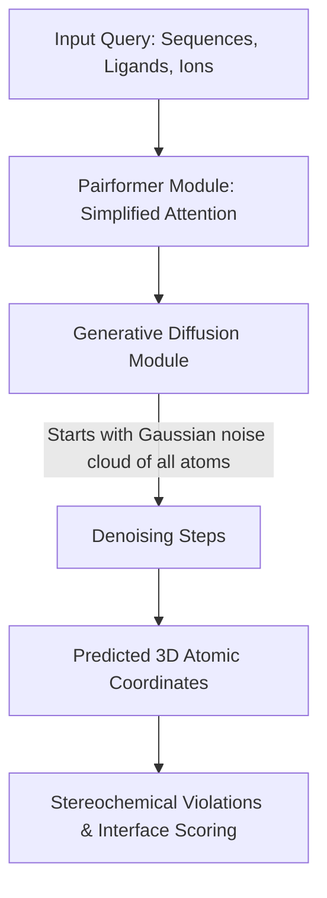

# 🧬 AlphaFold 3

AlphaFold 3 expands structural predictions to include proteins, nucleic acids (DNA and RNA), chemical ligands, ions, and post-translational chemical modifications.

## 🗺️ Architectural Concept / Workflow

## 🔍 Detailed Overview

### 1. Pairformer Architecture
The heavy and computationally expensive Evoformer in AlphaFold 2 is replaced by a lighter **Pairformer** module. The Pairformer operates directly on representations of input tokens (atoms or residues) and pairwise relations, skipping the complex multi-sequence alignment computation steps that dominated AlphaFold 2's runtime.

### 2. Generative Diffusion Module
Rather than predicting physical frames (IPA) and rigid bodies, AlphaFold 3 predicts atomic coordinates directly via a diffusion process. The network is trained to denoise raw 3D atomic coordinates starting from random Gaussian noise. This approach is highly robust and natively handles arbitrary molecule types (proteins, DNA, RNA, ligands, and ions) within the same generative pipeline.

## 📄 Key Publications & References
- **AlphaFold 3 Paper:** Abramson, J., Adler, J., Dunger, J., Evans, R., Green, T., Pritzel, A., Ronneberger, O., Willgof, L., Bates, R. F. X., Linehan, R., Köhler, C., Masters, A., Jamieson, E., Rudd, J., Grigorev, I., Szepesvari, N., Sloan, B., ... Jumper, J. (2024). Accurate structure prediction of biomolecular interactions with AlphaFold 3. *Nature*, 630(8016), 493-500. [DOI: 10.1038/s41586-024-07487-w](https://doi.org/10.1038/s41586-024-07487-w)

[⬅️ Back to README](../README.md)
