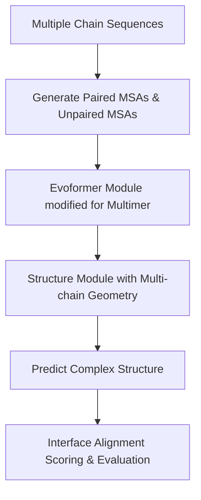

# 🧬 AlphaFold-Multimer

AlphaFold-Multimer is an extension of the AlphaFold 2 architecture optimized specifically for predicting multi-chain protein complexes (homomers and heteromers).

## 🗺️ Architectural Concept / Workflow

## 🔍 Detailed Overview

### 1. MSA Pairing
Predicting protein-protein complexes requires identifying which sequences in the MSA co-evolved across species. AlphaFold-Multimer uses a pairing strategy for the Multiple Sequence Alignments:
- **Paired MSA:** Sequences from the same species are matched to represent inter-chain interactions.
- **Unpaired MSA:** Species-specific sequences are treated independently to capture intra-chain folding.

### 2. Geometric Adjustments
AlphaFold-Multimer modifies the Frame representation in the Structure Module and allows coordinate updates across distinct chains. The scoring metrics are also updated to output Predicted Interface TM-score (ipTM) in addition to overall pLDDT, helping users evaluate the quality of the predicted protein-protein interfaces.

## 📄 Key Publications & References
- **AlphaFold-Multimer Paper:** Evans, R., O’Neill, M., Pritzel, A., Antropova, N., Senior, A., Green, T., Žídek, A., Bates, R., Blackwell, S., Yim, J., Ronneberger, O., Bodenstein, S., Zielinski, M., Bridgland, A., Wiles, C., Lukibabanova, E., Kyle, M., ... Jumper, J. (2021). Protein complex prediction with AlphaFold-Multimer. *bioRxiv*. [DOI: 10.1101/2021.10.04.463034](https://doi.org/10.1101/2021.10.04.463034)

[⬅️ Back to README](../README.md)
