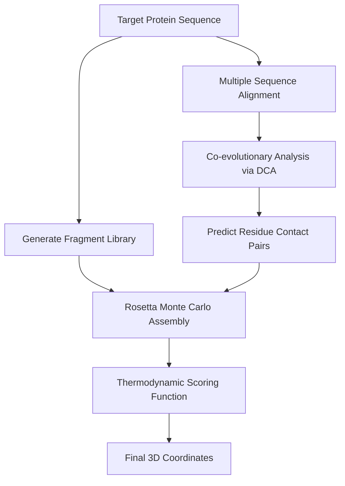

# 🧬 Pre-Deep Learning Foundations

The pre-deep learning era in structural biology was characterized by thermodynamic calculations, statistical physics, and template-based fragment assembly.

## 🗺️ Architectural Concept / Workflow

## 🔍 Detailed Overview

### 1. Rosetta Monte Carlo Fragment Assembly (Simons et al., 1997)
Rosetta works by assembling small structural fragments (usually 3 and 9 residue segments) derived from proteins in the Protein Data Bank (PDB) that have similar local sequences to the target. These fragments are assembled using a simulated annealing Monte Carlo search to find the minimum of a rough physical scoring function.

### 2. Direct Coupling Analysis (Morcos et al., 2011)
Direct Coupling Analysis (DCA) is a statistical physics framework that infers spatial proximity contacts between residue pairs by looking at co-evolutionary patterns in Multiple Sequence Alignments (MSAs). DCA disentangles direct interactions from indirect ones using global statistical models (like Maximum Entropy models).

## 📄 Key Publications & References
- **Rosetta Foundation:** Simons, K., Kooperberg, C., Huang, E., & Baker, D. (1997). Assembly of Protein Tertiary Structures from Fragments with Similar Local Sequences using Simulated Annealing and Bayesian Scoring Functions. *Journal of Molecular Biology*, 268(1), 209-225. [DOI: 10.1006/jmbi.1997.0959](https://doi.org/10.1006/jmbi.1997.0959)
- **DCA Foundation:** Morcos, F., Pagnani, A., Lunt, B., Bertolino, A., Marks, D. S., Sander, C., Zecchina, R., Onuchic, J. N., Hwa, T., & Weigt, M. (2011). Direct-coupling analysis of residue coevolution captures native contacts across many protein families. *PNAS*, 108(49), E1293-E1301. [DOI: 10.1073/pnas.1111471108](https://doi.org/10.1073/pnas.1111471108)

[⬅️ Back to README](../README.md)
